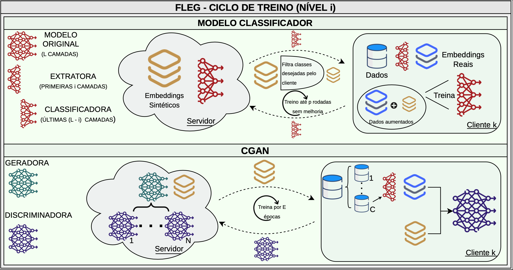

# Aprendizado Federado com Geração de Embeddings para Controle da Heterogeneidade Estatística

Este repositório contém o código utilizado para os experimentos do artigo "Aprendizado Federado com Geração de Embeddings para Controle da Heterogeneidade 
Estatística" e tem como objetivo permitir a reprodutibilidade e a execução de novos experimentos a respeito da solução FLEG em Aprendizado Federado. 
"O Aprendizado Federado permite o treinamento colaborativo de modelos de aprendizado de máquina sem o compartilhamento de dados locais, sendo uma alternativa 
promissora diante de crescentes preocupações com a privacidade. Contudo, a heterogeneidade na distribuição dos dados entre os clientes permanece um dos principais 
desafios, afetando negativamente o desempenho dos modelos. Neste trabalho, propomos o FLEG, uma abordagem que alterna o treinamento de um classificador com o de 
uma Rede Adversária Generativa Condicional (CGAN) para aumentar os conjuntos de dados dos clientes e reduzir a heterogeneidade estatística da federação e, 
consequentemente, melhorar o desempenho do modelo classificador. Diferentemente de abordagens convencionais, o FLEG gera embeddings sintéticos em vez de imagens, 
adicionando uma camada extra de proteção a possíveis vazamentos de dados. Os resultados experimentais mostram que o FLEG supera a baseline FedAvg em até 14 pontos percentuais na acurácia no 
conjunto CIFAR-10, nas configurações avaliadas."



# Estrutura do README.md

Este readme.md está organizado nos seguintes campos:
  - [Título e Resumo](#Aprendizado-Federado-com-Geração-de-Embeddings-para-Controle-da-Heterogeneidade-Estatística): Título do artigo publicado com este repositório e seu respectivo resumo.
  - Estrutura do README.md: Presente seção que descreve a estrutura do README.md
  - [Selos Considerados](#Selos-Considerados): Lista de selos a serem considerados na avaliação do repositório pelo comitê técnico de artefatos (CTA) do SBRC 2026.
  - [Informações Básicas](#Informações-Básicas): Informações para a execução e replicação dos experimentos, bem como a descrição do ambiente de execução, com requisitos de hardware e software.
  - [Instalação](#Instalação): Instruções sobre a preparação do ambiente para a execução dos experimentos.
  - [Dependências](#Dependências): Dependências para a execução e benchmarks utilizados.
  - [Teste Mínimo](#Teste-Mínimo): Instruções para um teste simplificado que permita utilizar o código.
  - [Experimentos](#Experimentos): Comandos e instruções para realizar os experimentos descritos e apresentados no artigo.
  - [LICENSE](#LICENSE): Detalhes sobre a licença para utilização do artefato.

# Selos Considerados
Os selos considerados são:
   - Artefatos Disponíveis (SeloD);
   - Artefatos Funcionais (SeloF);
   - Artefatos Sustentáveis (SeloS);
   - Experimentos Reprodutíveis (SeloR).

# Informações Básicas

O artefato consiste em três scripts em Python: "FLEG.py", script principal e responsável pelo fluxo de treinamento do FLEG; "task.py", com classes e funções auxiliares; e "generate_figs.py", que reproduz os gráficos apresentados no artigo. Além disso, inclui um arquivo de texto "requirements.txt" com as bibliotecas necessárias para a execução dos experimentos, um script shell para facilitar execução sequencial de múltiplos experimentos, este arquivo README.md, o arquivo de licença e o arquivo "FLEG.png" com a ilustração do FLEG.

O diretório "paper_experiments" contém os dados armazenados de cada experimento apresentado no artigo. Isso significa que os experimentos contidos neste artefato são referentes ao _trial_ que obteve a mediana das acurácias máximas para cada combinação de parâmetros testada. Desse modo, a pasta "paper_experiments" contém 44 pastas, sendo que cada uma é nomeada de acordo com os parâmetros do respectivo experimento, assim como explicado na seção [Teste Mínimo](#Teste-Mínimo). Para as pastas dos experimentos, deixamos disponível somente o arquivo "metrics.json" com métricas da execução do experimento. O diretório "experiments" é reservado para novas execuções de "FLEG.py"; caso não exista, ele é criado automaticamente.

Linguagem: Python versões 3.10 a 3.12. Todos os experimentos foram executados e validados com Python 3.10.18.

Ambiente de Teste: Compatível com Linux, Windows e MacOS. Testado com Linux Ubuntu 20.04.6 LTS.

Hardware Recomendado: * Mínimo de 8 GB de RAM.

GPU NVIDIA com suporte a CUDA (mínimo 4 GB VRAM) para execução acelerada, embora suporte execução em CPU.

# Instalação

Os arquivos do projeto podem ser obtidos ao clonar o repositório Git:
```bash
git clone https://github.com/gustavoguaragna/FLEG.git
cd FLEG
```
Recomenda-se a criação de um ambiente virtual para evitar conflitos entre pacotes:
```bash
# No Linux/macOS:
python3 -m venv venv
source venv/bin/activate
```
```bash
# No Windows:
python -m venv venv
.\venv\Scripts\activate
```
Deve-se garantir que python esteja instalado. A instalação pode ser feita no site oficial do [python](https://www.python.org/downloads/).

Com o ambiente ativado, instale os pacotes necessários:
```bash
pip install --upgrade pip
pip install -r requirements.txt
```

Para confirmar que o ambiente está configurado corretamente, execute o comando de ajuda do script principal:

```bash
python FLEG.py --help
```
Se a lista de argumentos for exibida no terminal, a instalação foi concluída e o ambiente está devidamente configurado para a execução do script principal.

# Dependências

As dependências core para execução são:

torch e torchvision: Framework de Deep Learning.

flwr e flwr-datasets: Framework para Aprendizado Federado e particionamento de dados.

datasets: Integração com Hugging Face para carregamento do MNIST/CIFAR-10.

numpy e matplotlib: Suporte matemático e visualização de métricas.

A instalação de todas as dependências necessárias pode ser feita como indicado na seção [Instalação](#Instalação), utilizando o arquivo "requirements.txt" ou através do comando:

```bash
pip install torch torchvision flwr==1.15.2 flwr-datasets==0.5.0 datasets==3.1.0 numpy matplotlib tqdm
```

# Teste mínimo
Execute os comandos desta seção para testar se o script principal pode ser executado sem erros. Este teste não visa reproduzir os resultados completos do 
experimento, mas apenas demonstrar o funcionamento básico do artefato. 

Para agilizar o processo de treinamento, o argumento "test_mode" é utilizado para definir outros parâmetros automaticamente. São eles:
 - num_chunks:  Número de _chunks_ para o treinamento da CGAN (Parâmetro "C" no artigo);
 - gan_epochs: Número de épocas de treinamento da CGAN (Parâmetro "E" no artigo);
 - patience: Número de épocas sem melhoria na acurácia no treinamento da classificadora (Parâmetro "p" no artigo).
Todos esses parâmetros são definidos para ter o valor 2 neste teste.
Além disso, o conjunto de dados total utilizado é reduzido a 10% do tamanho original.

Dessa forma, o teste mínimo deve durar cerca de 2 minutos para completar, sem o uso de GPU. Durante a execução, mensagens de log referentes ao treinamento são 
exibidas no console, e um subdiretório é criado dentro do diretório "experiments", na raiz do repositório. O subdiretório é nomeado de acordo com os parâmetros selecionados 
do experimento, de forma que para o teste mínimo o caminho será: "experiments/mnist_ClassPartitioner_fedavg_numchunks2_ganepochs2_dynamic_fleg_trial1". Dentro dele são gerados 
seis arquivos. Cinco arquivos são de checkpoints de treinamento (um por nível), nomeados no formato "checkpoint_level{i}.pth" , sendo {i} o número do respectivo nível. Para o nível 5, o nome é "checkpoint_end.pth".
Esses arquivos contêm o dicionário de estado do modelo classificador, assim como o nível e o conjunto de _embeddings_ sintéticos gerado para utilização no próximo
nível. O conjunto de _embeddings_ não está presente no "checkpoint_end.pth", uma vez que para o último nível não há treinamento da CGAN. O arquivo restante é
nomeado "metrics.json", e contém métricas gerais do treinamento, como acurácia de validação, tempo de treinamento e quantidade de informação a ser transferida na 
rede.
O comando para a execução do teste é:
```bash
python FLEG.py --test_mode
```


# Experimentos

Para facilitar a execução dos experimentos realizados no artigo, disponibilizamos a sequência de comandos no arquivo "run_experiments.sh". Nele não estão listados os experimentos realizados e que não estão apresentados no artigo, correspondendo somente ao _trial_ que atingiu a mediana das acurácias máximas dos _trials_ para uma dada combinação de parâmetros. Dessa maneira, são listados os comandos para um total de 44 experimentos que, em uma GPU NVIDIA Quadro RTX 6000, levou aproximadamente 48 horas para a execução. Durante a execução de cada experimento, é criado um subdiretório dentro de "experiments/", nomeado de acordo com os 
parâmetros do experimento, no padrão: '{dataset}\_{particionador}\_{baseline}_numchunks{número de chunks}\_ganepochs{épocas da GAN}\_{modo para geração de dados}_fleg_trial{identificador do _trial_}'.
Para executar o arquivo "run_experiments.sh" o usuário deve ter permissão para execução. Em Linux, basta executar o seguinte comando na primeira vez em que for usar:
```bash
chmod +x run_experiments.sh
```

Para executar todos os experimentos, basta executar o arquivo "run_experiments.sh" no diretório raiz do experimento após ativar o ambiente virtual, conforme recomendado na seção [Instalação](#Instalação) deste README:
```bash
./run_experiments.sh
```
Dentro do diretório de cada experimento são gerados seis arquivos conforme explicado na seção [Teste mínimo](#Teste-Mínimo) deste README. 

Os gráficos apresentados no artigo baseiam-se nos arquivos "metrics.json" disponíveis em "paper_experiments/" e são gerados pelo script "generate_figs.py". Basta executar o comando abaixo, utilizando o argumento --figure para indicar o número da figura correspondente no artigo que se deseja gerar. Por exemplo, para a Figura 2:
```bash
python generate_figs.py --figure 2
```
O script "generate_figs.py" cria o subdiretório ./figures e salva a figura desejada em pdf no subdiretório criado. São possíveis gerar os gráficos das figuras 2, 3, 4 e 5 do artigo. A figura 1 é o panorama geral do método e não contém resultados.

# LICENSE

Este projeto está licenciado sobre a Licença GNU GPLv3. Verifique o arquivo LICENSE para todos os detalhes.
